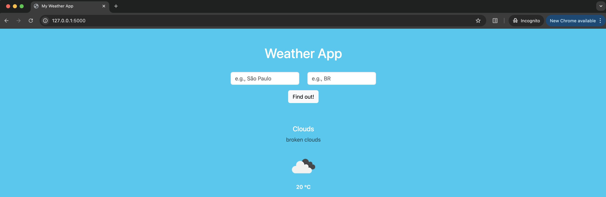

# Python Weather App

A simple weather application built with Python and Flask that fetches and displays weather information.



## Features

- Get current weather conditions.
- Display temperature, humidity, and weather descriptions.
- Simple command-line interface to start the framework and load the app.

## Installation

1. Clone this repository:
```bash
git clone https://github.com/mmaisonette/python-weather-app.git
cd python-weather-app
```

2. Install required dependencies:
```bash
pip3 install -r requirements.txt
```

## Usage

To run the Flask application in development mode with auto-reload:
```bash
export FLASK_ENV=development
python3 app.py
```

Or on Windows:
```bash
set FLASK_ENV=development
python3 app.py
```

Then navigate to `http://localhost:5000` in your web browser to access the weather app.

## Testing

Run the `pytest` suite to validate the weather module:

```bash
pytest test_weather.py
```

The test in `test_weather.py` monkeypatches the helper functions to avoid live API calls and asserts that `weather.main()` returns a `WeatherData` object with the expected attributes.

## Requirements

- Python 3.x (preferable version 3.12+)
- Required packages listed in `requirements.txt`

## Configuration

Add your API key (if required) to a `.env` file:
```
API_KEY=your_api_key_here
```

>Note: To obtain the API KEY, go to [OpenWeather](https://openweathermap.org/) and sign up into the web site.

## License

This project is open source and available under the MIT License.

## Legal Statement

 This project was made for study purposes only. No production usage is recommended!